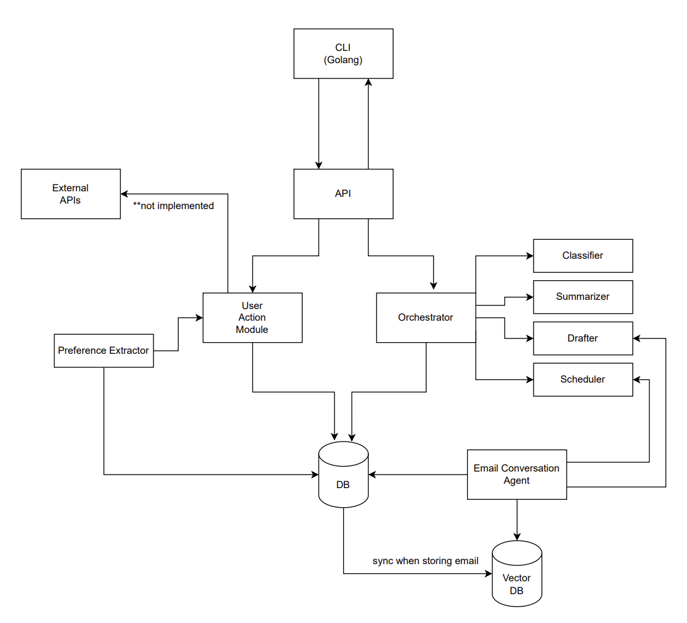
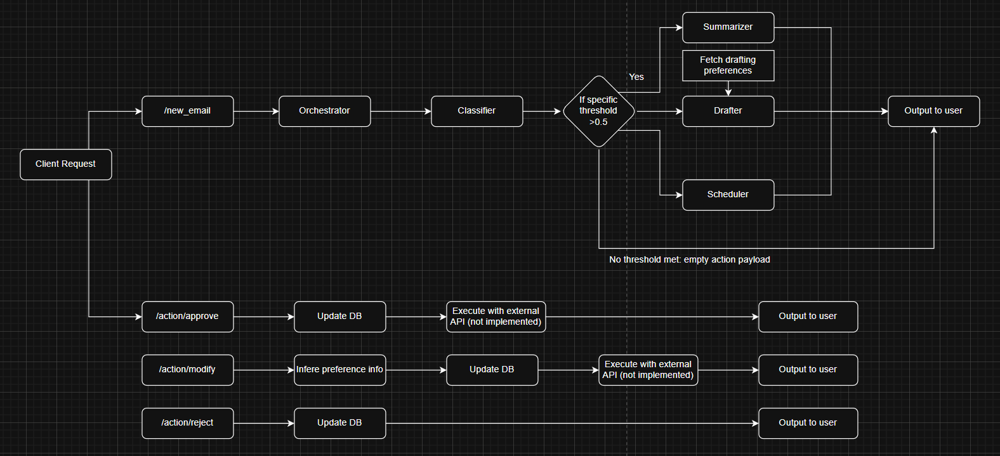

This repo contains a multi-agent application that processes incoming mail, produces helpful AI-generated responses, and captures user feedback to continuously improve suggestions. No actual external API connections are implemented and all external flow is mocked.

## Key Features
- Multi-agent pipeline for classification, summarisation, drafting, scheduling, and preference extraction.
- FastAPI backend that exposes the orchestration workflow as a simple REST API.
- Bubble Tea terminal client that lets you preview threads, review agent output, and approve or edit actions.
- SQLite-backed memory that retains message history, generated artefacts, and user editing patterns.
- Built-in observability via structured logging and Langfuse traces for every agent invocation.

## Architecture Overview

- **Backend service (Python).** `backend/src/email_assistant` hosts the FastAPI app, orchestration logic, agent wrappers, and persistence layer. The backend exposes endpoints to ingest new emails and to approve, reject, or modify proposed actions.
- **Terminal client (Go).** `cli/` provides a Bubble Tea TUI that drives the demo flow: load sample threads, submit them to the backend, and step through generated outputs.
- **Shared schema.** `backend/src/email_assistant/business/models.py` defines Pydantic models that are shared between agents, the orchestrator, and API payloads so the contract stays consistent end to end.
- **Persistence layer.** `backend/src/email_assistant/storage/db.py` wraps a SQLite database (`assistant.db`) that stores raw emails, generated actions, summaries, and user preference data.

### Agent Design
All agents are implemented with `pydantic_ai.Agent` and instrumented for tracing. They share the same OpenAI chat model (configurable via `OPENAI_MODEL`).
- `EmailClassifierAgent` estimates whether a thread needs a summary, draft reply, or calendar proposal and produces boolean decisions based on configurable thresholds.
- `EmailSummarizerAgent` produces a thread recap that is contextualised with the configured user's environment variables (`USER_NAME`, `USER_EMAIL`).
- `EmailDrafterAgent` generates reply drafts, optionally conditioned on stored drafting preferences and inferred tone.
- `EmailSchedulerAgent` proposes structured follow-up events with timestamp and supporting notes.
- `PreferenceExtractionAgent` analyses user edits to drafts and derives reusable writing preferences that can be applied globally or to specific recipients.

### Orchestration Flow

1. The `/new_email` endpoint persists the message, rebuilds the thread, and runs the classifier.
2. The orchestrator spins up the relevant agents concurrently (summary, draft, scheduler) depending on classifier decisions.
3. Generated artefacts are normalised into `Action` records, stored in the database, and returned to the caller alongside probabilities and decisions.
4. User endpoints (`/action/approve`, `/action/reject`, `/action/modify`) update the stored action state, capture execution results, and optionally extract preference information for modified drafts.
5. Modified preferences are fed into subsequent draft generations via `_build_drafting_preferences`, closing the learning loop.

## Memory Strategy
- **Thread storage.** Every inbound email is written to the `emails` table keyed also by `thread_id`, enabling reconstruction of conversation context for agent runs and summaries.
- **Action storage.** Proposed drafts and calendar events are tracked in the `actions` table with status transitions (`pending`, `executed`, `rejected`, etc.).
Execution metadata is supposed to be stored in the `result` column (Not implemented).
- **Summaries.** Generated summaries are stored in the `summaries` table. The idea was to fetch these summaries to avoid feeding whole threads (not implemented in the end).
- **Preference learning.** When a user edits a draft, the preference extractor derives structured preferences. These are either persisted per recipient in `action_preferences` (for personalised tone/greeting/signature rules) or applied globally via `general_preferences`.
- **Synthetic sent mail.** Approved or modified drafts are inserted back into the `emails` table to extend the thread, ensuring future agent runs see the full conversation including AI-authored responses.

## Observability & Monitoring
- **Structured logging.** `logging_utils.LogsHandler` centralises log configuration using the `LOG_LEVEL` environment variable. Logs are emitted with timestamps, levels, and module names for easy ingestion into log pipelines.
- **Langfuse tracing.** `Agent.instrument_all()` and `@observe` decorators wrap each agent and orchestrator method. Every invocation is captured as a trace with inputs, outputs, and timing metadata.
- **Trace correlation.** `Orchestrator.process_new_email` seeds a session id so all downstream agent calls for a message share a Langfuse trace, making it easy to inspect a full workflow in the Langfuse UI.

## Getting Started

### Prerequisites
- Python 3.10+
- Go 1.23+
- An OpenAI API key (or compatible interface) and Langfuse credentials for tracing
- **COMPULSORY TO HAVE LANGFUSE INSTALLED LOCALLY AND SET THE CREDENTIALS IN THE .ENV FILE**

### Configure environment variables
Create a .env file and populate the missing keys.
```bash
OPENAI_API_KEY=""
LANGFUSE_SECRET_KEY=""
LANGFUSE_PUBLIC_KEY=""
LANGFUSE_HOST="http://localhost:3000"
LOG_LEVEL="debug"
USER_EMAIL="user@example.com"
USER_NAME="Adrian"
```

### Install backend dependencies
```bash
cd backend
python -m venv .venv
source .venv/bin/activate  # On Windows use .venv\Scripts\Activate.ps1
pip install --upgrade pip
pip install -r requirements.txt
```

### Install CLI dependencies
```bash
cd cli
go mod tidy
```

## Run setup
Run the `reset_memory.py` script to seed the DB and have an agent populate the `general_preferences` table based on the sample data provided in `data/approved_drafts.json`.
```bash
cd backend
python -m src.email_assistant.scripts.reset_memory
```

## Running the stack

### Backend API
Run the FastAPI server:
```bash
cd backend
python -m src.email_assistant.main ## won't work without working langfuse setup and creds
```
This command initialises logging, checks Langfuse connectivity, and exposes the REST API at `http://localhost:8000`.

### Terminal UI
Start the Bubble Tea client once the backend is reachable:
```bash
cd cli
go run . --host localhost --port 8000
```
The client loads sample threads, submits them to the backend, and guides you through reviewing summaries, classifications, and proposed actions. Approving or editing actions will update the SQLite state and feed new preferences back into the system.

## Project Structure
- `backend/src/email_assistant/api`: FastAPI routes and dependency wiring.
- `backend/src/email_assistant/agents`: LLM-backed agents for classification, drafting, scheduling, summarisation, and preference extraction.
- `backend/src/email_assistant/orchestrator.py`: Core workflow that coordinates agents and persistence.
- `backend/src/email_assistant/storage`: SQLite data access layer and helpers.
- `backend/src/email_assistant/user_actions.py`: Helpers and utilities for applying user feedback.
- `cli/`: Bubble Tea TUI client and API bindings.
